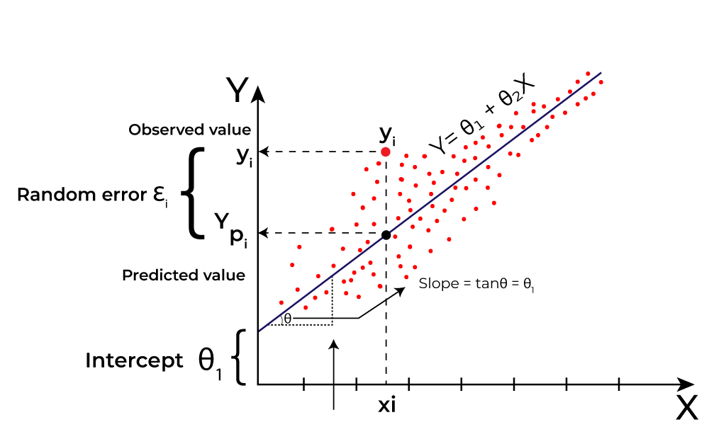
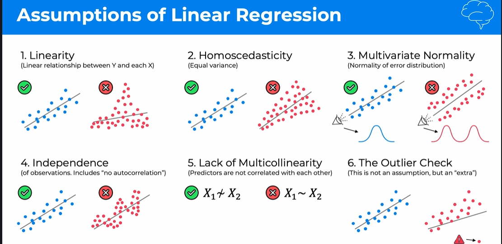

### Table of Contents
1. [Slope-intercept form of linear regression](#slope-intercept-form-of-linear-regression)
2. [Assumption of linear regression](#assumption-of-linear-regression)
3. [What is a Dummy Variable?](#what-is-a-dummy-variable)
4. [The Dummy Variable Trap](#the-dummy-variable-trap)
5. [How to Escape the Trap: The $n-1$ Rule](#how-to-escape-the-trap-the-n-1-rule)
6. [What is Hypothesis meaning in plain language?](#what-is-hypothesis-meaning-in-plain-language)
7. [What is Null Hypothesis meaning in plain language?](#what-is-null-hypothesis-meaning-in-plain-language)
8. [What is P-value in plain language?](#what-is-p-value-in-plain-language)
9. [Steps involved in building a machine learning model:](#steps-involved-in-building-a-machine-learning-model)
    1. [All in](#all-in)
    2. [Backward Elimination](#backward-elimination)
    3. [Forward Selection](#forward-selection)
    4. [Bidirectional Elimination](#bidirectional-elimination)
    5. [All Possible Models](#all-possible-models)
    6. [Best one from this methods:](#best-one-from-this-methods)
10. [Feature Scaling in Multiple Linear Regression:](#feature-scaling-in-multiple-linear-regression)


## Slope-intercept form of linear regression

The slope-intercept form of a linear regression model is given by the equation:
$$y = b_0 + b_1x_1 + b_2x_2 + b_3x_3 + ... + b_nx_n$$
Where:
- $y$ is the dependent variable (the outcome we are trying to predict).
- $b_0$ is the intercept (the value of $y$ when all independent variables are zero).
- $b_1, b_2, b_3, ..., b_n$ are the coefficients of the independent variables $x_1, x_2, x_3, ..., x_n$ respectively. 

These coefficients represent the change in the dependent variable for a one unit change in the corresponding independent variable, while holding all other independent variables constant.



## Assumption of linear regression

Before we proceed with multiple linear regression, it's important to understand the assumptions that underlie this technique. These assumptions include:
1. **Linearity**: The relationship between the dependent variable and each independent variable should be linear.
2. **Independence**: The observations should be independent of each other.
3. **Homoscedasticity**: The variance of the residuals should be constant across all levels of the independent variables.
4. **Normality**: The residuals should be approximately normally distributed.
5. **No multicollinearity**: The independent variables should not be highly correlated with each other.




---

## What is a Dummy Variable?
In your dataset, you have a `Country` column with values like *France*, *Spain*, and *Germany*. You cannot multiply "France" by a weight ($w$). 

**One-Hot Encoding** creates new columns for each category. If a row is "France," the France column gets a `1` and the others get a `0`. These $0$ and $1$ columns are your **Dummy Variables**.


---

## The Dummy Variable Trap
The "Trap" is a scenario where independent variables are highly correlated—a state called **Multicollinearity**. 

Imagine you have a "Gender" category: **Male** and **Female**.
* If you create two columns (`Is_Male` and `Is_Female`).
* If `Is_Male` is `1`, `Is_Female` **must** be `0`.
* If `Is_Male` is `0`, `Is_Female` **must** be `1`.

**The Mathematical Problem:** The variable `Is_Female` can be perfectly predicted by the formula:  
`Is_Female = 1 - Is_Male`

In Linear Regression, the model tries to find the individual effect of each variable. If one variable is a perfect predictor of another, the underlying math (matrix inversion) breaks. It's like trying to solve an equation where $X + Y = 10$, but you're also told $X$ is always $10 - Y$. You haven't added new information; you've just created a redundant loop.

---

## How to Escape the Trap: The $n-1$ Rule
To avoid the trap, you must always drop **one** dummy column. 

* If you have **3 countries**, you only include **2 dummy columns**.
* If you have **2 genders**, you only include **1 dummy column**.

**Why does this work?**
If you have columns for *Spain* and *Germany*, and both are `0`, the model mathematically "knows" the country must be *France* (the dropped category). The dropped category becomes the **Reference Group** or **Base Case** that all other variables are measured against.

## What is <b>Hypothesis</b> meaning in plain language?
A hypothesis is a proposed explanation or prediction for a phenomenon or a set of observations. In plain language, it's like an educated guess that you can test through experiments or data analysis. For example, if you hypothesize that "drinking coffee improves focus," you can design an experiment to test this hypothesis by measuring focus levels in people who drink coffee versus those who don't. The goal is to determine whether your hypothesis is supported by the evidence or if it needs to be rejected or revised.

## Whats is <b>Null Hypothesis</b> meaning in plain language?
A null hypothesis is a statement that there is no effect or no relationship between variables in a study. In plain language, it's like saying "nothing is happening" or "there is no difference." For example, if you are testing whether a new drug is effective, the null hypothesis would be that the drug has no effect on patients compared to a placebo. The null hypothesis serves as a starting point for statistical testing, and researchers aim to gather evidence to either reject or fail to reject it based on the data collected.

## What is P-value in plain language?
A p-value is a measure used in statistical hypothesis testing to determine the strength of the evidence against the null hypothesis. In plain language, it helps you understand how likely it is that your observed results occurred by random chance. A low p-value (typically less than 0.05) suggests that the observed results are unlikely to have occurred by chance, leading you to reject the null hypothesis. Conversely, a high p-value indicates that the observed results could easily occur by random chance, and you would fail to reject the null hypothesis. In essence, the p-value helps you decide whether your findings are statistically significant or not.

For example coine flip experiment:

Table of outcomes and P-values in Hypothesis Testing and Null Hypothesis:
| Outcome           | P-value Interpretation                          |
|-------------------|-----------------------------------------------|
| 10 heads, 0 tails | P-value < 0.05 (Reject Null Hypothesis) |
| 9 heads, 1 tail   | P-value < 0.05 (Reject Null Hypothesis) |
| 8 heads, 2 tails  | P-value < 0.05 (Reject Null Hypothesis) |
| 7 heads, 3 tails  | P-value < 0.05 (Reject Null Hypothesis) |
| 6 heads, 4 tails  | P-value < 0.05 (Reject Null Hypothesis) |
| 5 heads, 5 tails  | P-value = 0.5 (Fail to Reject Null Hypothesis) |

P-value  = Probability of observing the data (or something more extreme) assuming the null hypothesis is true.

## Steps involved in building a machine learning model:
1. **Data Collection**: Gathering relevant data for training the model.
2. **Data Preprocessing**: Cleaning and transforming the data to make it suitable for modeling.
3. **Feature Engineering**: Creating new features or selecting important features from the data.
4. **Model Selection**: Choosing the appropriate machine learning algorithm for the task.
5. **Model Training and Evaluation**: Training the model on the data and evaluating its performance using metrics like accuracy, precision, recall, etc.

### Methods 
1. All in
2. Backward Elimination
3. Forward Selection
4. Bidirectional Elimination
5. Score Comparison

### 1. **All in**: 
This method involves including all available features in the model without any feature selection. It is a straightforward approach but can lead to overfitting if there are too many irrelevant features.

<b>Why use it:</b> It is simple and can be effective when you have a small number of features or when you are unsure about which features to include.

### 2. **Backward Elimination**:
This method starts with all features and iteratively removes the least significant feature based on a chosen criterion (e.g., p-value, AIC, BIC). The process continues until only significant features remain.

<b>Why use it:</b> It helps in identifying and removing irrelevant features, which can improve model performance and reduce overfitting.

Steps involved in Backward Elimination:
1. Fit the model with all features.
2. Identify the least significant feature based on the chosen criterion, by checking the p-value of each feature or using other metrics like AIC or BIC.

example: 
```python
import statsmodels.api as sm
X = sm.add_constant(X)  # Adding a constant term for the intercept
model = sm.OLS(y, X).fit()  # Fit the model with all features
p_values = model.pvalues  # Get p-values for each feature
least_significant_feature = p_values.idxmax()  # Identify the least significant feature
```
3. Remove the least significant feature and refit the model.

4. Repeat steps 2 and 3 until all remaining features are significant.

<b>Example of Backward Elimination in plain language:</b>
List of features: [Feature A, Feature B, Feature C, Feature D]
1. Fit the model with all features: [Feature A, Feature B, Feature C, Feature D]
2. Identify the least significant feature (e.g., Feature C with p-value > 0.05).
3. Remove Feature C and refit the model: [Feature A, Feature B, Feature D]
4. Repeat the process until all remaining features are significant.

### 3. **Forward Selection**:
This method starts with no features and iteratively adds the most significant feature based on a chosen criterion (e.g., p-value, AIC, BIC). The process continues until no more significant features can be added.

<b>Why use it:</b> It is useful when you have a large number of features and want to identify the most important ones without starting with a full model.

Steps involved in Forward Selection:
1. Start with an empty model (no features).
2. Identify the most significant feature based on the chosen criterion, by checking the p-value of each feature or using other metrics like AIC or BIC.
```python
import statsmodels.api as sm
X = sm.add_constant(X)  # Adding a constant term for the intercept
model = sm.OLS(y, X).fit()  # Fit the model with all features
p_values = model.pvalues  # Get p-values for each feature
most_significant_feature = p_values.idxmin()  # Identify the most significant feature
```
3. Add the most significant feature to the model and refit it.
4. Repeat steps 2 and 3 until no more significant features can be added.

<b>Example of Forward Selection in plain language:</b>List of features: [Feature A, Feature B, Feature C, Feature D]
1. Start with an empty model: []
2. Identify the most significant feature (e.g., Feature A with p-value < 0.05).
3. Add Feature A to the model and refit: [Feature A]
4. Repeat the process until no more significant features can be added.

### 4. **Bidirectional Elimination**:

This method combines both backward elimination and forward selection. It starts with an initial model (which can be empty or full) and iteratively adds or removes features based on their significance.
1. Start with an initial model (can be empty or full).
2. Perform backward elimination to remove any insignificant features.
3. Perform forward selection to add any significant features that were not included in the initial model.
4. Repeat steps 2 and 3 until no more features can be added or removed.
```python
import statsmodels.api as sm
X = sm.add_constant(X)  # Adding a constant term for the intercept
model = sm.OLS(y, X).fit()  # Fit the initial model
p_values = model.pvalues  # Get p-values for each feature
# Backward elimination
least_significant_feature = p_values.idxmax()  # Identify the least significant feature
# Forward selection
most_significant_feature = p_values.idxmin()  # Identify the most significant feature
```

<b>Why use it:</b> It provides a more comprehensive approach to feature selection by considering both the addition and removal of features, which can lead to a more optimal model.

<b>Example of Bidirectional Elimination in plain language:</b>
List of features: [Feature A, Feature B, Feature C, Feature D]
1. Start with an initial model: [Feature A, Feature B]
2. Perform backward elimination to remove any insignificant features (e.g., Feature B with p-value > 0.05).
3. Perform forward selection to add any significant features that were not included in the initial model (e.g., Feature C with p-value < 0.05).
4. Repeat the process until no more features can be added or removed, resulting in a final model: [Feature A, Feature C].

### All Possible Models:
This method involves evaluating all possible combinations of features to identify the best model based on a chosen criterion (e.g., AIC, BIC, adjusted R-squared). It is computationally expensive but can provide insights into the importance of each feature and the interactions between features.
```python
import itertools
import statsmodels.api as sm
X = sm.add_constant(X)  # Adding a constant term for the intercept
best_aic = float('inf')
best_model = None
for i in range(1, len(X.columns) + 1):
    for combination in itertools.combinations(X.columns, i):
        model = sm.OLS(y, X[list(combination)]).fit()
        if model.aic < best_aic:
            best_aic = model.aic
            best_model = model
```

<b>Why use it:</b> It allows for a thorough evaluation of all feature combinations, which can lead to the identification of the most predictive model, especially when there are interactions between features.


### Best one from this methods:
The best method for feature selection depends on the specific dataset and the goals of the analysis. However, **Bidirectional Elimination** is often considered a robust approach as it combines the strengths of both backward elimination and forward selection, allowing for a more comprehensive evaluation of features. It can help in identifying the most significant features while also ensuring that irrelevant features are removed, leading to a more optimal model.


## C:

In Multiple Linear Regression, feature scaling is not always necessary because the coefficients of the model will adjust accordingly to the scale of the features. The model learns the coefficients for each feature, and these coefficients reflect the scale of the features. For example, if one feature has a much larger scale than another, the coefficient for that feature will be smaller to compensate for its larger values.

Example : Feature A, Feature B, Feature C
- Feature A has values in the range of 0 to 1 (small scale).
- Feature B has values in the range of 0 to 1000 (large scale).
- The coefficient for Feature A might be larger than the coefficient for Feature B to account for the difference in scale.
